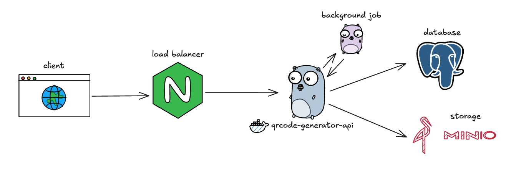

# QR Code Generator API
<p align="center">
    
    
    
    
    <svg role="img" viewBox="0 0 24 24" xmlns="http://www.w3.org/2000/svg" id="Minio--Streamline-Simple-Icons" width="40" height="40">
    <path d="M13.2072 0.006c-0.6216 -0.0478 -1.2 0.1943 -1.6211 0.582a2.15 2.15 0 0 0 -0.0938 3.0352l3.4082 3.5507a3.042 3.042 0 0 1 -0.664 4.6875l-0.463 0.2383V7.2853a15.4198 15.4198 0 0 0 -8.0174 10.4862v0.0176l6.5487 -3.3281v7.621L13.7794 24V13.6817l0.8965 -0.4629a4.4432 4.4432 0 0 0 1.2207 -7.0292l-3.371 -3.5254a0.7489 0.7489 0 0 1 0.037 -1.0547 0.7522 0.7522 0 0 1 1.0567 0.0371l0.4668 0.4863 -0.006 0.0059 4.0704 4.2441a0.0566 0.0566 0 0 0 0.082 0 0.06 0.06 0 0 0 0 -0.0703l-3.1406 -5.1425 -0.1484 0.1425 0.1484 -0.1445C14.4945 0.3926 13.8287 0.0538 13.2072 0.006Zm-0.9024 9.8652v2.9941l-4.1523 2.1484a13.9787 13.9787 0 0 1 2.7676 -3.9277 14.1784 14.1784 0 0 1 1.3847 -1.2148z" fill="#ff2c00"/>
    </svg>
</p>

This is my first Go API project. It provides a simple RESTful interface for generating QR codes.

## Design



## Endpoints

The API provides the following endpoints for interacting with the QR Code generation service:

### 1. Create a QR Code

**POST** `/api/v1/qr`

**Description:** Creates a new QR Code based on the provided content.

**Request Body:**
```json
{
    "content": "https://example.com", // QR Code content
    "size": 256,                     // Size (256 to 1024)
    "recovery_level": 3             // Error recovery level (0 to 3)
}
```

**Response:** Status: `201 Created`

**Example:**
```json
{
    "data": {
        "id": "00000000-0000-0000-0000-000000000000",
        "url": "http://example.com/qr/00000000-0000-0000-0000-000000000000.png",
        "content": "https://example.com",
        "created_at": "2025-09-08T12:00:00Z",
        "expires_at": "2025-09-15T12:00:00Z"
    }
}
```

### 2. List all QR Codes

**GET** `/api/v1/qr`

**Description:** Returns a list of all generated QR Codes.

**Response:** Status: `200 OK`

**Example:**
```json
{
    "data": [
        {
            "id": "00000000-0000-0000-0000-000000000000",
            "url": "http://example.com/qr/00000000-0000-0000-0000-000000000000.png",
            "content": "https://example.com",
            "created_at": "2025-09-08T12:00:00Z",
            "expires_at": "2025-09-15T12:00:00Z"
        }
    ]
}
```

### 3. Get a QR Code by ID

**GET** `/api/v1/qr/{id}`

**Description:** Returns the details of a specific QR Code by its ID.

**Response:** Status: `200 OK`

**Example:**
```json
{
    "data": {
        "id": "00000000-0000-0000-0000-000000000000",
        "url": "http://example.com/qr/00000000-0000-0000-0000-000000000000.png",
        "content": "https://example.com",
        "created_at": "2025-09-08T12:00:00Z",
        "expires_at": "2025-09-15T12:00:00Z"
    }
}
```

### 4. Check API status

**GET** `/api/v1/ping`

**Description:** Checks if the API is running correctly.

**Response:** Status: `200 OK`

**Example:**
```json
{
    "message": "pong"
}
```