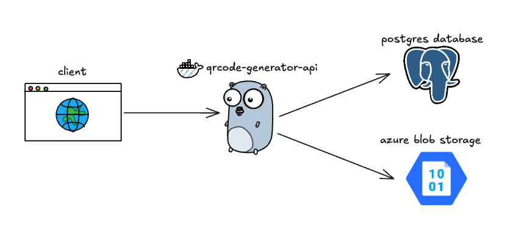

# QR Code Generator API
<p align="center">
    
    
    
    
    <svg role="img" viewBox="0 0 24 24" xmlns="http://www.w3.org/2000/svg" id="Minio--Streamline-Simple-Icons" width="40" height="40">
</p>

This is my first Go API project. It provides a simple RESTful interface for generating QR codes.

## Design



## Endpoints

The API provides the following endpoints for interacting with the QR Code generation service:

### 1. Create a QR Code

**POST** `/api/v1/qr`

**Description:** Creates a new QR Code based on the provided content.

**Request Body:**
```json
{
    "content": "https://example.com", // QR Code content
    "size": 256,                     // Size (256 to 1024)
    "recovery_level": 3             // Error recovery level (0 to 3)
}
```

**Response:** Status: `201 Created`

**Example:**
```json
{
    "data": {
        "id": "00000000-0000-0000-0000-000000000000",
        "url": "http://storage.blob.core.windows.net/qr/00000000-0000-....",
        "content": "https://example.com",
        "size": 256,
        "recovery_level": 3,
        "created_at": "2025-09-08T12:00:00Z",
        "expires_at": "2025-09-15T12:00:00Z"
    }
}
```

### 2. List all QR Codes

**GET** `/api/v1/qr`

**Description:** Returns a list of all generated QR Codes.

**Response:** Status: `200 OK`

**Example:**
```json
{
    "data": [
        {
            "id": "00000000-0000-0000-0000-000000000000",
            "url": "http://storage.blob.core.windows.net/qr/00000000-0000-....",
            "content": "https://example.com",
            "size": 256,
            "recovery_level": 3,
            "created_at": "2025-09-08T12:00:00Z",
            "expires_at": "2025-09-15T12:00:00Z"
        }
    ]
}
```

### 3. Get a QR Code by ID

**GET** `/api/v1/qr/{id}`

**Description:** Returns the details of a specific QR Code by its ID.

**Response:** Status: `200 OK`

**Example:**
```json
{
    "data": {
        "id": "00000000-0000-0000-0000-000000000000",
        "url": "http://storage.blob.core.windows.net/qr/00000000-0000-....",
        "content": "https://example.com",
        "size": 256,
        "recovery_level": 3,
        "created_at": "2025-09-08T12:00:00Z",
        "expires_at": "2025-09-15T12:00:00Z"
    }
}
```

### 4. Delete a QR Code

**DELETE** `/api/v1/qr/{id}`

**Description:** Deletes a specific QR Code by its ID.

**Response:** Status: `204 No Content`

### 5. Check API status

**GET** `/api/v1/ping`

**Description:** Checks if the API is running correctly.

**Response:** Status: `200 OK`

**Example:**
```json
{
    "message": "pong"
}
```

## Background Worker

The API includes a **cleanup worker** that runs automatically in the background. This worker performs the following tasks every hour:

- **Database Cleanup**: Removes expired QR code records from PostgreSQL where `expires_at` is equal to or before the current hour
- **Storage Cleanup**: Deletes expired QR code image files from Azure Blob Storage that are older than 24 hours